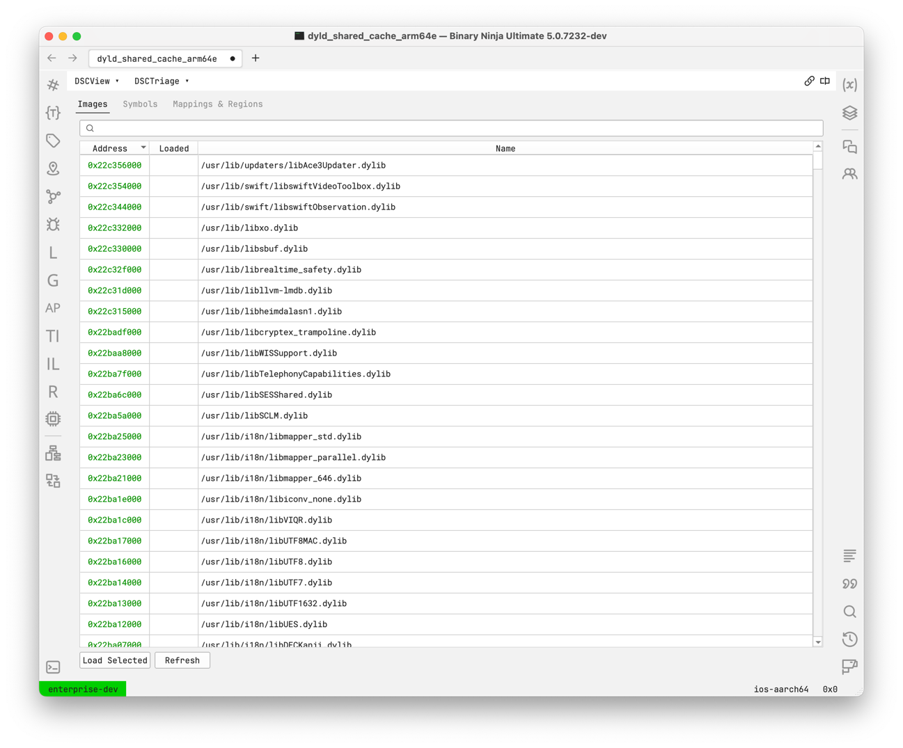
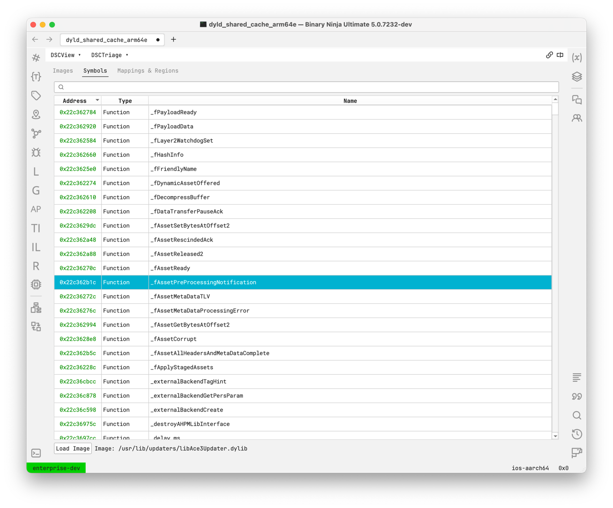
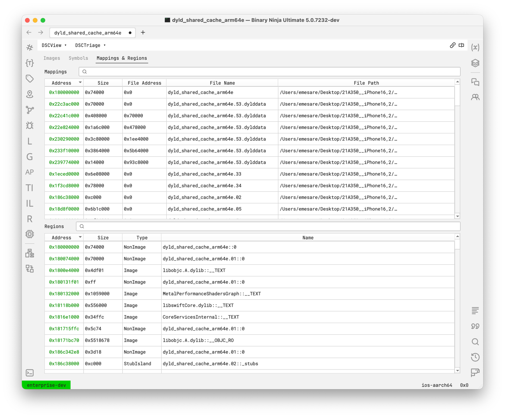

# Shared Cache

Shared Cache support in Binary Ninja provides you with tools to selectively load specific images, search for 
specific symbols, and follow analysis references between any loaded images in one view.

## Support Matrix

List of supported features for the given shared cache targets.

| Platform | Arch   | Versions | Features                    |
|----------|--------|----------|-----------------------------|
| iOS      | arm64  | 11 - 18  | Core, Objective-C, Workflow |
| macOS    | x86_64 | 11 - 15  | Core, Objective-C, Workflow |
| macOS    | arm64  | 11 - 15  | Core, Objective-C, Workflow |

- **Core**: Core functionality, such as loading, navigating, and analyzing shared cache files.
- **Objective-C**: Support for analyzing Objective-C information and symbols within the shared cache.
- **Workflow**: Shared cache workflow that improves on the base Binary Ninja analysis with shared cache specific analysis.

## Obtaining a Shared Cache

The shared cache is one or more files that contain all the shared libraries used by macOS and iOS. These can be obtained
directly from apple, or with the help of a tool such as `blacktop/ipsw`.

### With blacktop/ipsw tool

The recommended way to retrieve iOS shared caches is using blacktop's wonderful ipsw tool.

1. [Install blacktop/ipsw](https://github.com/blacktop/ipsw?tab=readme-ov-file#install)
2. Run `ipsw download ipsw --version [target iOS version] --device [target device model (e.g. iPhone10,3)]`
3. Run `ipsw extract --dyld [filename]`

### With Local macOS install

The local shared cache on macOS is located at `/System/Volumes/Preboot/Cryptexes/OS/System/Library/dyld/`.

## Opening a Shared Cache

Binary Ninja currently supports shared cache files extracted into a flat directory only, so you will need to extract the IPSW (if there is one) first.

- `your_directory`
    - `dyld_shared_cache_arm64` (**Primary**)
    - `dyld_shared_cache_arm64.01` (Secondary, optional)
    - `dyld_shared_cache_arm64.02` (Secondary, optional)
    - `dyld_shared_cache_arm64.symbols` (Symbols, optional)

To access the entire shared cache, open the **Primary** file in Binary Ninja, for the example above this would be `dyld_shared_cache_arm64`.
Opening any other file (e.g. `dyld_shared_cache_arm64.01`) will result in a partial shared cache, with only the information present
in the file you opened.

### Project Support

Shared caches are supported for Binary Ninja projects, however due to the nature of the project files not having a mappable path,
saving shared cache databases (`.bndb`) in a seperate directory will require you to select the primary shared cache file on
every open of the database. It is advised to keep your shared cache databases next to your shared cache files (in the same folder).

- `your_project_folder`
  - `dyld_shared_cache_arm64` (**Primary**)
  - `dyld_shared_cache_arm64.01` (Secondary, optional)
  - `dyld_shared_cache_arm64.02` (Secondary, optional)
  - `dyld_shared_cache_arm64.symbols` (Symbols, optional)
  - `your_database.bndb` (This is recommended)

## Interacting with a Shared Cache

After opening a shared cache you will be provided a supercharged binary view, one which has information not only from
the opened primary file, but all the associated files (ex. `dyld_shared_cache_arm64.02`). Because of the large size of these
caches we cannot load all the information into the binary view, instead we do so selectively.

### Shared Cache Triage (DSCTriage)

The main way to interact with the shared cache information is through the triage view. This is the first thing you see when
opening a shared cache and is how you add images to the actual binary view.

=== "Images"
    Shows a list of all images within the shared cache and their virtual addresses.
    
    - Double click on an image to load
    - Select image(s) and click button "Load Selected" to load multiple images at once
    - Select image(s) and right click if you want more options for loading images

    

=== "Symbols"
    Shows a list of all exported symbols within the shared cache and their virtual addresses.

    - Double click on a symbol to load the associated image, or use the "Load Image" button

    
    
=== "Mappings & Regions"
    Shows information about the entry mappings and the cache regions.

    

### Scripting

Another way to interact with the shared cache information is through the provided python API, available in the `binaryninja.sharedcache` module.

Additionally, the `dsc` magic variable is available in the scripting console whenever a Shared Cache is opened.

```python
# Load all dependency images for the current loaded images
from binaryninja import sharedcache
for image in dsc.loaded_images:
    dependencies = dsc.get_image_dependencies(image)
    for dependency in dependencies:
        dep_image = dsc.get_image_with_name(dependency)
        if dep_image is None:
            continue
        dsc.apply_image(bv, dep_image)
```

## Glossary

### CacheEntry

A **CacheEntry** is a single file in the shared cache. It contains images, symbols, and regions that collectively
represent a portion of the shared cache's contents.

### CacheRegion

A **CacheRegion** is the logical segment of the shared cache for which the memory is mapped into the `BinaryView`. It
represents distinct sections of the cache, no region should be overlapping.

### CacheImage

A **CacheImage** is a single shared library within the shared cache. It consists of sections (located within cache
regions) that include both code and data. This is analogous to a single mach-o file.

### CacheSymbol

A **CacheSymbol** represents a symbol within the shared cache, such as a function or data variable. It is **not** a view
symbol and is **not** directly available from the `BinaryView`. Instead, it is specifically associated with the shared
cache data, otherwise we would be putting millions of symbols into the view and slowing down the core unnecessarily.
